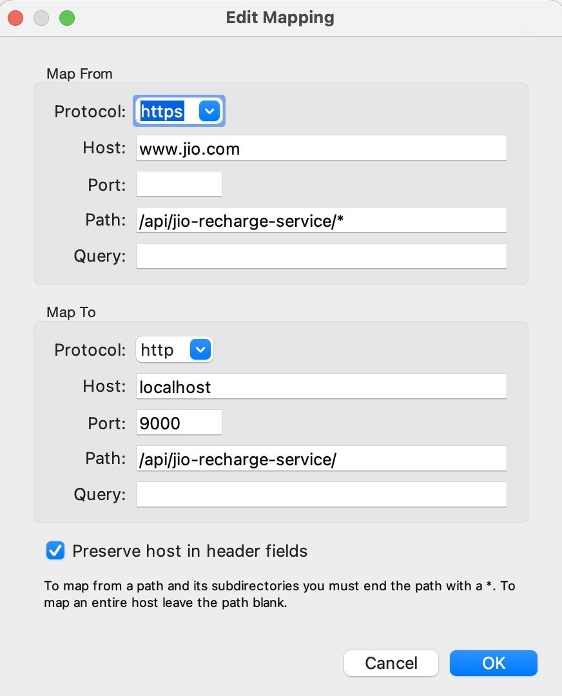
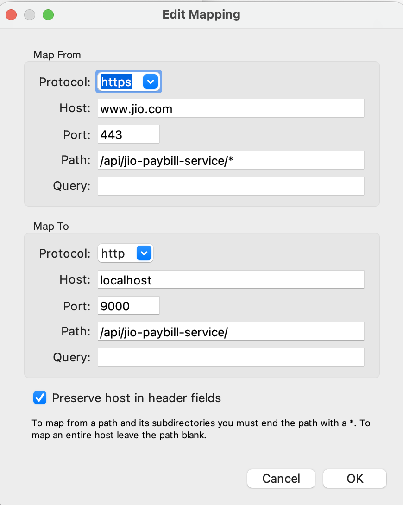
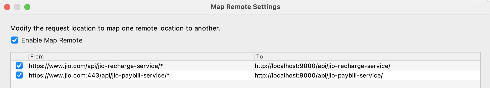

# Testing Negative Scenarios in A Deployed Application Using Selenium, Applitools & Specmatic

## Overview

This repository demonstrates how to validate **both positive and negative end-to-end scenarios against a deployed application** using a controlled and safe testing approach.

It combines:
- **Selenium (Java)** for functional automation
- **Applitools Visual AI** for visual and UI regression testing
- **Specmatic** for intelligent, spec-compliant API stubbing

The key objective is to enable **negative scenario testing in a deployed application** by selectively stubbing specific backend APIs, while allowing the rest of the application traffic to hit the live environment.

---

## Technology Stack

- Java 17+
- Selenium (Java)
- Gradle
- Applitools Eyes (Visual AI)
- Specmatic (API stubbing)
- Charles Proxy (traffic interception & routing)
- Google Chrome

---

## Prerequisites & Machine Setup

1. Install **JDK 17 or higher**
2. Ensure **Google Chrome** is installed
3. Clone the repository:
   ```bash
   git clone https://github.com/anandbagmar/testing-negative-scenarios-in-prod
   ```
4. Open the project in your IDE **as a Gradle project**
    - All dependencies will be resolved automatically

---

## Applitools Visual AI Setup

To run tests with Applitools Visual AI:

1. Sign up for a <a href="https://auth.applitools.com/users/general-register?app=eyes" target="_blank" rel="noopener noreferrer">
   Applitools trial account
   </a>

2. Obtain your **APPLITOOLS_API_KEY**

3. Configure the API key using one of the following options:

### Option A: Environment Variable (Recommended)
```bash
export APPLITOOLS_API_KEY=<your_api_key>
```

### Option B: Hardcode in Test (Not recommended for CI)
Update the following line in  
`src/test/java/com/eot/e2e/negative/JioRecharge_UFG_Test.java`

```java
eyes.setApiKey(System.getenv("APPLITOOLS_API_KEY"));
```

Replace with:
```java
eyes.setApiKey("<replace_me>");
```

---

## Charles Proxy Setup

Charles Proxy is used to **route selected application API calls to a local Specmatic stub server**, while allowing all other traffic to continue to the live environment.

### Installation

1. Download and install <a href="https://www.charlesproxy.com/download/" target="_blank" rel="noopener noreferrer">
   Charles Proxy
   </a>
2. Launch the Charles application

---

### Proxy Configuration

1. Navigate to:
   ```
   Proxy → Proxy Settings → Proxies
   ```
2. Ensure:
    - **HTTP Proxy** is enabled
    - Port is set to **8888**

---

### Install Charles Root Certificate

1. Go to:
   ```
   Help → SSL Proxying → Install Charles Root Certificate
   ```
2. Set the certificate to **Always Trust**

---

### Map Remote Configuration

Configure the following mappings under:
```
Tools → Map Remote
```

#### Mapping 1 – Recharge Service
- **From**  
  `https://www.jio.com:443/api/jio-recharge-service/*`
- **To**  
  `http://localhost:9000/api/jio-recharge-service/*`

Reference image: 

---

#### Mapping 2 – Paybill Service
- **From**  
  `https://www.jio.com:443/api/jio-paybill-service/*`
- **To**  
  `http://localhost:9000/api/jio-paybill-service/*`

Reference image: 

---

#### Final Map Remote View
Your Map Remote window should resemble the following: 


---

## Specmatic Setup

Specmatic provides **intelligent, spec-compliant API stubs** to simulate positive, negative, and edge-case backend scenarios.

### Certificates

- Install and **Always Trust** all certificates located in:
  ```
  src/test/resources/jio-certs
  ```

---

### Download Specmatic

Download the latest Specmatic JAR:
```bash
curl -L -f -o ./src/test/resources/specmatic/specmatic.jar \
https://github.com/specmatic/specmatic/releases/latest/download/specmatic.jar
```

---

### Start the Specmatic Stub Server

Start the mock server using the Jio API specification:
```bash
java -jar ./src/test/resources/specmatic/specmatic.jar stub \
./src/test/resources/specmatic/specs/jio_com_api_spec.yaml
```

The stub server will start on **http://localhost:9000**.

---

## Running the Tests

### Option 1: Run from IDE
Execute `JioRecharge_UFG_Test` directly from your IDE.

### Option 2: Run from Command Line
```bash
./gradlew clean test --tests com.eot.e2e.negative.JioRecharge_UFG_Test
```

---

## Key Outcomes

- Enables **safe negative scenario testing in a deployed environment**
- Avoids manipulating real data
- Combines **functional and visual validation**
- Demonstrates **selective API stubbing** without breaking the full user journey

---

## Notes

- This project is intended for **educational, POC, and controlled enterprise testing use cases**
- Always ensure you have appropriate approvals before testing against any deployed environments

---
